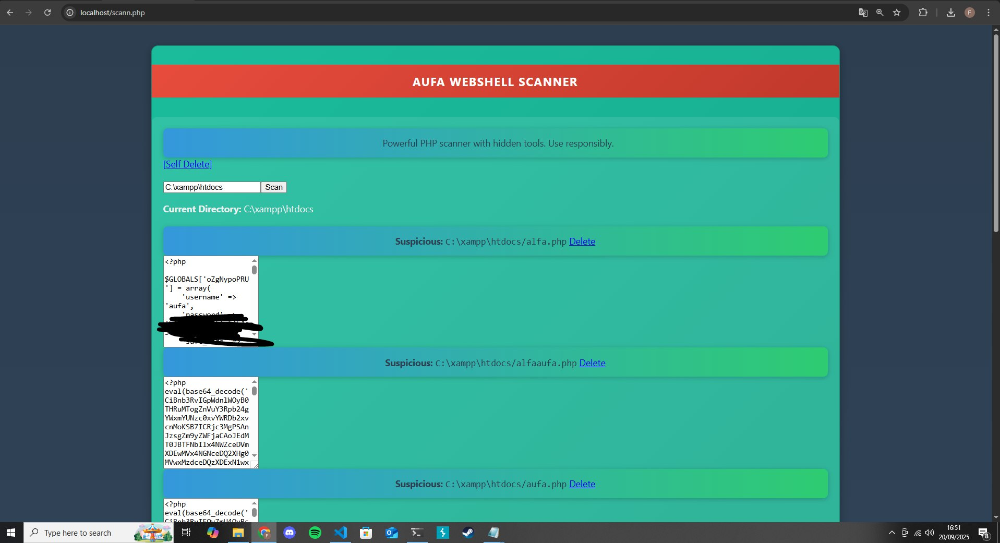

The appearance is straightforward.

Shell Scan

Aims to find other people's shells on websites.

Show code in file feature.
Delete all malicious files.
Lightweight and fast.
Result: Shell file/malicious file automatically creates wop.txt file.

**Password:** aufa
